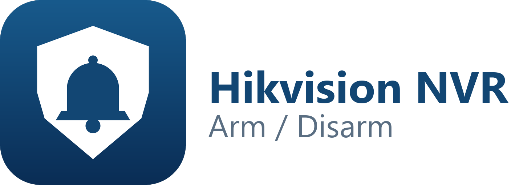

# Hikvision NVR Arm/Disarm

Home Assistant custom integration that arms and disarms **Hik-Connect push notifications** on a Hikvision NVR, with a single switch.

## How it works

Hik-Connect sends push notifications only for events whose linkage has **Notify Surveillance Center** enabled. The integration adds or removes
`<notificationMethod>center</notificationMethod>` on the selected event triggers through ISAPI (`/ISAPI/Event/triggers/<id>`), then reads the NVR back to verify.

- **On** = armed (push notifications are sent), **Off** = disarmed (none are sent).
- The Hik-Connect app itself stays armed all the time; the NVR decides what gets sent.
- Applying a change takes the NVR a few seconds per event, so switching takes about 10 seconds; the switch shows the requested state right away and
  is then verified against the NVR.
- State is read from the NVR every minute, so changes made in the NVR UI show up too.
- If only some of the selected events are armed the switch state is *unknown* (attribute `partial: true`).

Verified on a DS-7608NI-M2/8P (firmware V5.04.087) with DS-2CD2347G2H-LISU/SL cameras.

### What it changes (and what it does not)

- The setup lists **every per-channel event the NVR has** (motion, intrusion, line crossing, tamper, video loss, ...), whether or not that detection is
  actually enabled on the camera. Events that currently notify the surveillance center are preselected; pick only the ones you use.
- Arm/disarm changes **only** the *Notify Surveillance Center* linkage of the selected events. It does **not** enable or disable detection, and it does
  not touch recording, alarm output/siren, buzzer or any other linkage action. Those keep working while disarmed.
- If you select an event whose detection is turned off on the camera, arming adds the linkage but no notifications will come, because the event never fires.

### Good to know

- **Motion events reach Home Assistant only while armed.** The NVR's event stream (`alertStream`, used by e.g. `hikvision_next`) is fed by the same
  *Notify Surveillance Center* linkage, so disarming silences it too. Use another source if you need motion sensors while disarmed.
- The NVR may accept **only SHA-256 digest** authentication (as the test NVR does). This integration implements it (MD5 digest too), which is why plain
  `curl --digest` / `rest_command` do not work against such NVRs.
- The NVR username is **case-sensitive**.

## Requirements

- Home Assistant 2025.1 or newer, able to reach the NVR over HTTP or HTTPS.
- An NVR user with **Remote: Parameters Settings** (Configuration → System → User Management). Create a dedicated user for this.
  That single permission is enough (verified: reading and changing the event linkage worked with only it). Cameras that are offline on the NVR
  are not returned by the NVR and do not appear in the event list.

## Install

Copy `custom_components/hikvision_nvr_arm` into your Home Assistant `config/custom_components/` folder (or add this repository to HACS as a custom repository),
restart Home Assistant, then *Settings → Devices & services → Add integration → Hikvision NVR Arm/Disarm*.

### Setup in short

1. **Put the NVR in the state you want to control:** in the Hik-Connect app / NVR the notifications you normally get must be **armed** (i.e. currently working).
2. Add the integration and enter the NVR host, port and the dedicated user. Tick *Use HTTPS* if you use it (see below).
3. The next screen lists the events that are armed right now, grouped by type with your camera names, e.g.

   - **Intrusion**: all cameras
   - **Motion**: Iejimas, Auto aikstele, ...

   Just continue, that is the right choice for most setups. Tick *Choose the events myself* only if you want a different set.
4. Done: use `switch.<nvr>_hik_connect_notifications`.

If nothing is armed when you add the integration you get the full list with nothing preselected, so arm the NVR first. Change the events later under
*Configure*.

The integration icon and logo are shown by Home Assistant 2026.3 or newer (local `brand/` images); older versions work normally but show no icon.

### HTTPS

Tick **Use HTTPS** and set the port (usually 443). NVRs normally use a self-signed certificate, which Home Assistant cannot verify, so the setup then
fails with a TLS/certificate error. Untick **Verify SSL certificate** to trust the NVR's certificate anyway; with verification on, the certificate
must be trusted by Home Assistant. Connection settings, credentials and the SSL options can be changed later under *Reconfigure*, and if the NVR
rejects the saved password Home Assistant offers a re-authentication prompt.

## Entities

| Entity | Description |
| --- | --- |
| `switch.<nvr>_hik_connect_notifications` | On = armed. Attributes: `armed_events`, `disarmed_events`, `partial`. |

Turning the switch on or off raises an error (visible in the UI, usable in automations with `continue_on_error`) if any event could not be changed or the read-back
does not match.

## Tools

`tools/` has PowerShell scripts used while developing this (`hik-notify.ps1` arm/disarm/status, `hik-events.ps1` event stream listener) and
`tests/live_api_check.py` checks the API client against a real NVR. They read credentials from `NVR_USER` / `NVR_PASS` environment variables.
